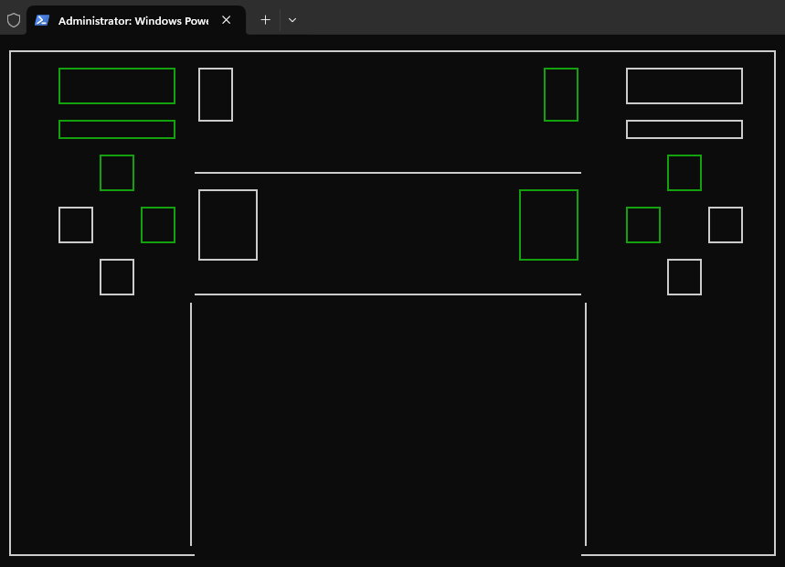

# DualShock4 tester

TUI to test if your PlayStation4 controller is working properly. Press the buttons on your controller and watch how the TUI indicates it has been pressed.

## Data 
The following byte array is an example of what is received from the DualShock4 controller. By staring at changes in this i figured out which buttons are represented by which byte.

`[1, 126, 124, 129, 123, 8, 0, 224, 0, 0, 215, 246, 10, 239, 255, 2, 0, 251, 255, 180, 0, 74, 32, 35, 6, 0, 0, 0, 0, 0, 26, 0, 0, 1, 246, 132, 106, 0, 0, 128, 0, 0, 0, 0, 128, 0, 0, 0, 128, 0, 0, 0, 0, 128, 0, 0, 0, 128, 0, 0, 0, 0, 128, 0]`

